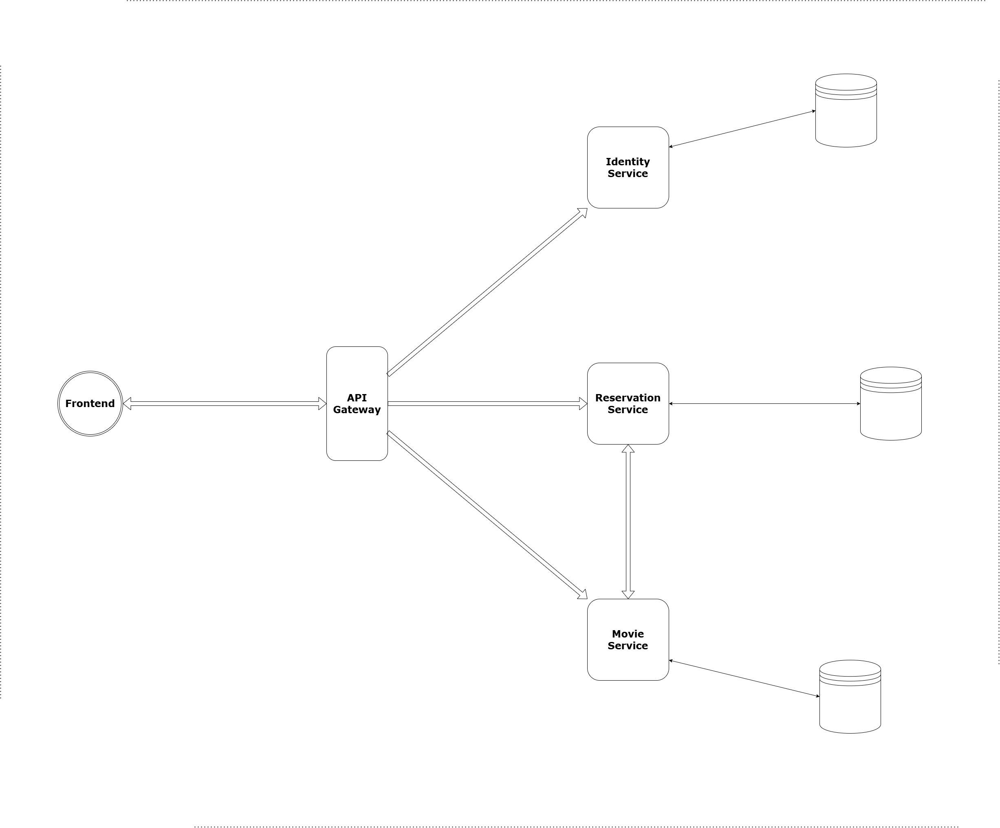

# Cinema Seat Reservation System

_A cloud-native, microservices-based ecosystem developed in ASP.NET Core with REST APIs. This system features deliberate design decisions optimized for modularity, scalability and resilience — implementing proven distributed systems patterns such as Retries and Circuit Breakers and Request Timeouts alongside automated CI pipelines and manual deployment workflow._

---

## Architectural Overview

### Diagram

### Services

| Service | Responsibility |
|---------|---------------|
| **API Gateway** | Centralized authentication, rate limiting, request timeouts, and routing to the main services |
| **Identity Service** | Centralized Identity Provider — user management and JWT issuance |
| **Movie Service** | Movies and showtimes management | 
| **Reservation Service** | Seat layout, seat holds, and seat reservations |

---

## Getting Started

The system is live and ready to test via **[Postman Workspace](https://www.postman.com/mazenaly256-3830648/workspace/cinema-seat-reservation-system-api-documentation)**

The workspace includes:
- Complete API documentation, with organized request collections and folders for each service
- All API endpoints with example requests and responses, featuring interactive testing
- Pre-configured variables containing hosting Azure VM IP with ports to access the services

How to test:
- Go to the workspace and navigate to `identity-service` collection
- Issue a JWT by sending a request to a login endpoint and copy the JWT from response
- Navigate to the target endpoint in the relevant service collection and resource folder
- Copy the JWT and use it as Bearer Token in the authorization header of HTTP request
- Click `Send` and see the system's response

---

## Highlighted Engineering Decisions

**Detailed decisions are documented in [ADRs](docs/decisions/)**

### Concurrency Correctness
- Double-booking is prevented at database level by applying **seat locking** — ensuring exactly one concurrent reservation succeeds regardless of how many concurrent requests target the same seat.

### Resilience
- Request timeout of 8 seconds enforced at the API Gateway level across the whole system
- Polly retry (2 retry attempts, 250ms/500ms exponential backoff) and circuit breaker (opens after 3 failures, recovers after 20s) on all Reservation Service HTTP calls to Movie Service

### Performance
- **Reduced P95 latency by 39%** (847ms → 516ms), **average latency by 48%**, and **increased throughput by 24%**. [More details about the impact of this decision](docs/metrics/pagination-and-indexing-metrics.md)

### Observability
- OpenTelemetry SDK wired across all 4 services for **structured logging**, **distributed tracing** with trace-log correlation, and **metrics collection**
- Telemetry data is exported to **Grafana Cloud** (**Tempo** for traces, **Loki** for logs, **Prometheus** for metrics visualization)

### Error Handling
- All error responses comply with **RFC 7807** ProblemDetails standard

### CI Pipelines
- 4 GitHub Actions workflows, one per service, enabling automated build validation on every push by catching integration issues early and ensuring only verified images are pushed to GHCR.
- Path-filtered workflows, triggered only on source code changes, ensuring a change in one service never triggers unnecessary CI execution in others.

---

## Tech Stack

| Category | Tools |
|----------|-------|
| **Language & Framework** | C#, ASP.NET Core |
| **ORM** | Entity Framework Core |
| **API Gateway** | YARP (Yet Another Reverse Proxy) |
| **Databases** | PostgreSQL, MongoDB |
| **Authentication** | JWT |
| **Resilience** | Timeouts and Polly (Retry, Circuit Breaker) |
| **Observability** | OpenTelemetry, Grafana Cloud (Tempo, Loki, Prometheus) |
| **Containerization** | Docker, Docker Compose |
| **CI Pipeline** | GitHub Actions |
| **Docker Image Registry** | GitHub Container Registry (GHCR) |
| **Production Deployment** | Azure Cloud |
| **Load Testing** | k6 |

---
